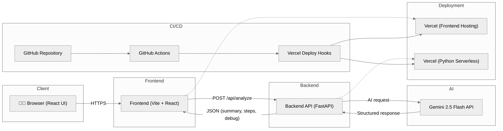

# Error Translator

AI-powered error analysis assistant for developers.  
Paste any stack trace or runtime error and get a clear summary, likely cause, and concrete fix/debug steps - powered by a FastAPI backend and a modern React (Vite) frontend.

> **Live demo:** https://error-translator.vercel.app

---

## 🎯 Features

- 🧠 **AI-based error explanation** - summary, likely cause, fix steps, debug steps.
- 🗂 **Language-aware** - optional language hint (JavaScript / Python / Java / auto detection).
- 💬 **Chat-like UI** - conversation view between you and the "Error Translator".
- 🕒 **History panel** - previous analyses, quick restore of past sessions.
- 📦 **Full-stack Docker support** - separate images for backend and frontend, plus `docker-compose`.
- 🔁 **CI/CD** - GitHub Actions for tests, linting, Docker image build, and Vercel deploy hooks.

---

## Architecture Overview

The system is split into three logical parts:

- **Frontend** - Vite + React + TypeScript  
- **Backend** - FastAPI (+ Gemini AI client)  
- **AI Provider** - Google Gemini (via API)



### 🌐 Deployment

- **Backend:** Vercel Python serverless environment  
- **Frontend:** Vercel static deployment (Vite build)  
- **CI/CD:** GitHub Actions → Vercel Deploy Hooks (production from `main`)

---

## 🛠️ Repositories & Structure

```text
.
├── backend/        # FastAPI app
├── frontend/       # Vite + React UI
├── docker-compose.yml
├── justfile        # Developer commands (backend + frontend + docker)
└── .github/
    └── workflows/  # CI/CD pipelines
```

- See `backend/README.md` for backend details.  
- See `frontend/README.md` for frontend details.

---

## 👨‍💻 Local Development

### Requirements

- Node.js 20+
- Python 3.12+
- Docker & docker-compose (optional, for containers)
- `just` (optional, for developer commands)

### Option A: Run everything locally (no Docker)

**Backend**

```bash
cd backend
python -m venv .venv
source .venv/bin/activate      # Windows: .venv\Scripts\activate

pip install -r requirements.txt
pip install -r requirements-dev.txt

# Set environment variables (or use .env)
# GEMINI_API_KEY=...

uvicorn app.main:app --reload --port 8000
```

**Frontend**

```bash
cd frontend
npm install

# .env.local:
# VITE_API_BASE_URL=http://localhost:8000

npm run dev
```

Frontend will run on http://localhost:5173 and call the backend at http://localhost:8000.

### Option B: Docker + docker-compose

```bash
# From repository root
docker compose up --build
```

This will build and run both services:

- Frontend → http://localhost:5173  
- Backend → http://localhost:8000  

---

## 🧪 Testing & Quality

### Backend

- Lint: `just lint-backend` (or `ruff check app tests`)
- Tests: `just test-backend` (or `pytest`)

### Frontend

- Lint: `just lint-frontend` (or `npm run lint` in `frontend/`)
- Unit tests: `npm run test:unit`
- E2E (optional, requires backend running): `npm run test:e2e`

---

## 🔄 CI/CD

We use GitHub Actions for both services.

### Backend CI/CD

- Install dependencies  
- `ruff` lint  
- `pytest`  
- Build Docker image (`error-translator-backend:ci`) and upload as artifact  
- On `main` → trigger Vercel backend deploy via `VERCEL_BACKEND_PROD_HOOK`.

### Frontend CI/CD

- Install dependencies  
- ESLint  
- Vitest unit tests  
- Build Vite app  
- Build Docker image (`error-translator-frontend:ci`) and upload as artifact  
- On `main` → trigger Vercel frontend deploy via `VERCEL_FRONTEND_PROD_HOOK` & Running Playwright E2E tests.

---

## ✨ Roadmap / Future Ideas

- Add user accounts and saved analysis history in a database.
- Support additional runtimes (Go, C#, Rust-specific hints).
- Export analysis as Markdown or PDF file.

